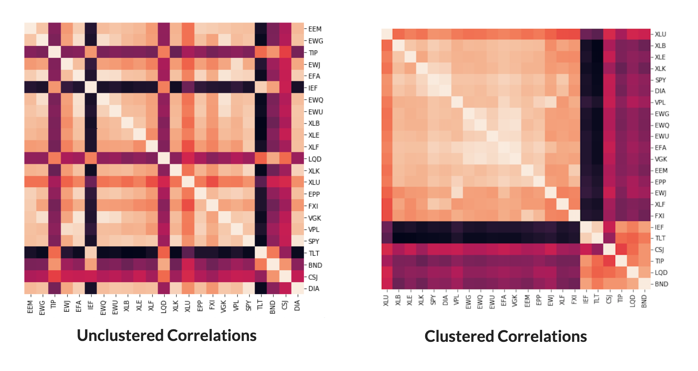

.. _portfolio_optimisation-hierarchical_risk_parity:

.. |br| raw:: html

     

.. |h3| raw:: html

    <h3>

.. |h3_| raw:: html

    </h3>

.. |h4| raw:: html

    <h4>

.. |h4_| raw:: html

    </h4>

.. note::
    The portfolio optimisation module contains different algorithms that are used for asset allocation and optimising strategies.
    Each algorithm is encapsulated in its own class and has a public method called ``allocate()`` which calculates the weight
    allocations on the specific user data. This way, each implementation can be called in the same way and this makes it simple
    for users to use them.

==============================
Hierarchical Risk Parity (HRP)
==============================

The Hierarchical Risk Parity algorithm is a novel portfolio optimisation method combining machine learning and traditional
portfolio optimisation. Although, it is a simple algorithm, it has been found to be very stable as compared to its older
counterparts (the traditional mean variance optimisation methods).

Overview of the Algorithm
#########################

Hierarchical Tree Clustering
****************************
This step breaks down the assets in our portfolio into different hierarchical clusters using the famous Hierarchical Tree
Clustering algorithm. The assets in the portfolio are segregated into clusters which mimic the real-life interactions between
the assets in a portfolio - some stocks are related to each other more than others and hence can be grouped within the same
cluster. At the end of the step, we are left with the follow tree structure (also called a dendrogram).

.. image:: portfolio_optimisation_images/dendrogram.png

|br|

Matrix Seriation
****************
Matrix seriation is a very old statistical technique which is used to rearrange the data to show the inherent clusters
clearly. Using the order of hierarchical clusters from the previous step, we rearrange the rows and columns of the covariance
matrix of stocks so that similar investments are placed together and dissimilar investments are placed far apart

|br|

Recursive Bisection
*******************
This is the final and the most important step of this algorithm where the actual weights are assigned to the assets in a
top-down recursive manner. Based on the hierarchical tree dendrogram formed in the first step, the weights trickle down the
tree and get assigned to the portfolio assets.

.. tip::
    |h4| Underlying Literature |h4_|

        * `Hierarchical Risk Parity Paper <https://papers.ssrn.com/sol3/papers.cfm?abstract_id=2708678>`_
        * For a detailed explanation of how hierarchical risk parity works, we have written an excellent `blog post <https://hudsonthames.org/an-introduction-to-the-hierarchical-risk-parity-algorithm/>`_ about it.

Implementation
##############

.. automodule:: mlfinlab.portfolio_optimization.hrp

    .. autoclass:: HierarchicalRiskParity
        :members:

        .. automethod:: __init__

.. note::
    |h4| Using Custom Input |h4_|
    We provide great flexibility to the users in terms of the input data - they can either pass their own pre-calculated input
    matrices/dataframes or leave it to us to calculate them. A quick reference on common input parameters which you will encounter
    throughout the portfolio optimisation module:

        * :py:mod:`asset_prices`: Dataframe/matrix of historical raw asset prices **indexed by date**.
        * :py:mod:`asset_returns`: Dataframe/matrix of historical asset returns. This will be a :math:`TxN` matrix where :math:`T` is the time-series and :math:`N` refers to the number of assets in the portfolio.
        * :py:mod:`expected_asset_returns`: List of expected returns per asset i.e. the mean of historical asset returns. This refers to the parameter :math:`\mu` used in portfolio optimisation literature. For a portfolio of 5 assets, ``expected_asset_returns = [0.45, 0.56, 0.89, 1.34, 2.4]``.
        * :py:mod:`covariance_matrix`: The covariance matrix of asset returns.

.. tip::
    |h4| Using Custom Distance Matrix |h4_|
    The hierarchical clustering step in the algorithm uses a distance matrix to calculate the clusters and form the hierarchical
    tree. By default, we use the distance matrix mentioned in the original paper,

    .. math::
        D(i, j) = \sqrt{\frac{1}{2} * (1 - \rho(i, j))}

    Here, :math:`\rho` refers to the correlation matrix of assets. Users can specify their own custom matrix to be used instead of
    the default one by passing an :math:`NxN` symmetric pandas dataframe or a numpy matrix using the :py:mod:`distance_matrix`
    parameter. **Note that the** :py:mod:`covariance_matrix` **is still requested for computing the clustered variances.**

    |h4| Constructing a Long/Short Portfolio |h4_|
    By default, the weights are allocated assuming a long portfolio i.e. all the weights are positive. However, users can also opt
    to have specific assets in their portfolio shorted, by specifying a custom list through the :py:mod:`side_weights` parameter.
    For e.g. in a portfolio of 5 assets, if you want the 3rd and the 5th asset to be shorted, then simply pass a list containing
    1s and -1s for long and short positions respectively. In the above case, ``side_weights = [1,1,-1,1,-1]``, where you
    have -1 at the 3rd and 5th index. By default, a list of 1s will be initialised if no custom input is specified.

    |h4| Different Linkage Methods |h4_|
    HRP, by default, uses the single-linkage clustering algorithm. (See the tip under the HERC algorithm for more details.)

Example Code
############

.. code-block::

    import pandas as pd
    from mlfinlab.portfolio_optimization.hrp import HierarchicalRiskParity

    # Read in data
    stock_prices = pd.read_csv('FILE_PATH', parse_dates=True, index_col='Date')

    # Compute HRP weights
    hrp = HierarchicalRiskParity()
    hrp.allocate(asset_prices=stock_prices)
    hrp_weights = hrp.weights.sort_values(by=0, ascending=False, axis=1)

    # Building a dollar neutral Long/Short portfolio by shorting the first 4 stocks and being long the others
    hrp = HierarchicalRiskParity()
    side_weights = pd.Series([1]*stock_prices.shape[1], index=self.data.columns)
    side_weights.loc[stock_prices.columns[:4]] = -1
    hrp.allocate(asset_prices=self.data, asset_names=self.data.columns, side_weights=side_weights)
    hrp.allocate(asset_prices=stock_prices, side_weights=side_weights)
    hrp_weights = hrp.weights.sort_values(by=0, ascending=False, axis=1)

Plotting
########

``plot_clusters()`` : Plots the hierarchical clusters formed during the clustering step in HRP. This is visualised in the form of dendrograms - a very common way of visualising the hierarchical tree clusters.

.. code-block::

    # Instantiate HRP Class
    hrp = HierarchicalRiskParity()
    hrp.allocate(asset_prices=stock_prices)

    # Plot Dendrogram
    hrp.plot_clusters(assets=stock_prices.columns)

.. image:: portfolio_optimisation_images/dendrogram.png

Research Notebooks
##################

The following research notebooks provide a more detailed exploration of the algorithm.

* `Chapter 16 Exercise Notebook`_

.. _Chapter 16 Exercise Notebook: https://github.com/hudson-and-thames/research/blob/master/Advances%20in%20Financial%20Machine%20Learning/Machine%20Learning%20Asset%20Allocation/Chapter16.ipynb

* `How to use mlfinlab's HierarchicalRiskParity class`_

.. _How to use mlfinlab's HierarchicalRiskParity class: https://github.com/hudson-and-thames/research/blob/master/Portfolio%20Optimisation%20Tutorials/Hierarchical%20Risk%20Parity%20(HRP)/HRP%20use%20examples.ipynb