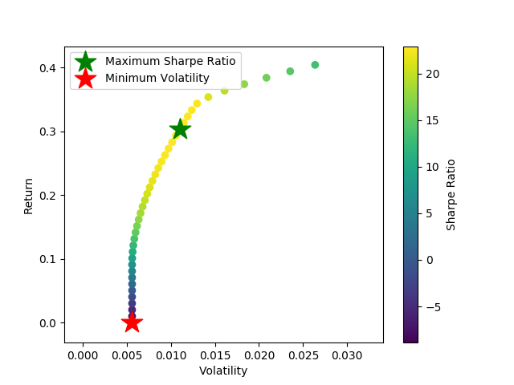

.. _portfolio_optimisation-mean_variance:

.. note::
    The portfolio optimisation module contains different algorithms that are used for asset allocation and optimising strategies. Each
    algorithm is encapsulated in its own class and has a public method called ``allocate()`` which calculates the weight allocations
    on the specific user data. This way, each implementation can be called in the same way and makes it simple for users to use them.
    Next up, lets discuss about some of these implementations and the different parameters they require.

==========================
Mean-Variance Optimisation
==========================

This class contains some classic Mean-Variance optimisation techniques based on Harry Markowitz's methods. We use
`cvxpy <https://www.cvxpy.org/index.html>`_ as our quadratic optimiser instead of the more frequently used
`scipy.optimize <https://docs.scipy.org/doc/scipy/reference/optimize.html>`_. This was a design choice for two reasons:
(a) the documentation of cvxpy is better than that of scipy and (b) cvxpy's code is much more readable and easier to understand.

Currently, the following solution strings are supported by MVO class:

1. ``inverse_variance`` : Calculates the weights according to simple inverse-variance allocation.
2. ``min_volatility`` : Calculates the weights relating to Minimum Variance portfolio.
3. ``max_sharpe`` : Calculates the weights relating to the maximum Sharpe Ratio portfolio. Users can specify the risk-free return value through the :py:mod:`risk_free_rate` parameter.
4. ``efficient_risk`` : Calculates an efficient risk portfolio for a specified target return. Users can specify their target return value through the :py:mod:`target_return` parameter.

Solutions
#########

Inverse Variance
****************

With this solution string, only the main diagonal of the covariance matrix is used for weights allocation:

.. math::

      W_{i} = \frac{\frac{1}{Cov_{i,i}}}{\sum_{j=1}^{N}{\frac{1}{Cov_{j,j}}}}

Where :math:`W_{i}` is the weight allocated to the :math:`i` -th element in a portfolio, :math:`Cov_{i,i}` is the :math:`i` -th element
on the main diagonal of the covariance matrix of elements in a portfolio, :math:`N` is the number of elements in a portfolio.

Minimum Variance
****************

With this solution string, the entire covariance matrix is used for weights allocation.

The following optimisation problem is being solved:

.. math::

      minimise: W^{T} * Cov * W

      s.t.: \sum_{j=1}^{N}{W_{j}} = 1

Where :math:`W` is the vector of weights, :math:`Cov` is the covariance matrix of elements in a portfolio,
:math:`N` is the number of elements in a portfolio.

Maximum Sharpe Ratio
********************

With this solution string, the entire covariance matrix, the vector of mean returns, and the risk-free ratio are used
for weights allocation.

The following optimisation problem is being solved:

.. math::
      :nowrap:

      \begin{align*}
      minimise: Y^{T} * Cov * Y
      \end{align*}

      \begin{align*}
      s.t.: \sum_{j=1}^{N}{(MeanRet_{j} - R_{f}) * Y_{j}} = 1
      \end{align*}

      \begin{align*}
      \sum_{j=1}^{N}{Y_{j}} = \kappa
      \end{align*}

      \begin{align*}
      \kappa \ge 0
      \end{align*}

After the optimisation: :math:`W_{j} = Y_{j} / \kappa`

Where :math:`W` is the vector of weights, :math:`Y` is the vector of unscaled weights, :math:`\kappa` is the scaling factor,
:math:`Cov` is the covariance matrix of elements in a portfolio, :math:`MeanRet` is the vector of mean returns,
:math:`R_{f}` is the risk-free rate, :math:`N` is the number of elements in a portfolio.

.. tip::

    The process of deriving this optimisation problem from the standard maximising Sharpe ratio problem is described
    in the notes `IEOR 4500 Maximizing the Sharpe ratio <https://www.coursehero.com/file/7013169/maximizing-the-sharpe-ratio/>`_  from Columbia University.

Efficient Risk
**************

With this solution string, the entire covariance matrix, the vector of mean returns, and the target return are used
for weights allocation.

The following optimisation problem is being solved:

.. math::
      :nowrap:

      \begin{align*}
      minimise : W^{T} * Cov * W
      \end{align*}

      \begin{align*}
      s.t.: \sum_{j=1}^{N}{MeanRet_{j} * W_{j}} = TrgetRet
      \end{align*}

      \begin{align*}
      \sum_{j=1}^{N}{W_{j}} = 1
      \end{align*}

Where :math:`W` is the vector of weights, :math:`Cov` is the covariance matrix of elements in a portfolio,
:math:`MeanRet` is the vector of mean returns, :math:`TrgetRet` is the target return, :math:`N` is the number of elements in a portfolio.

.. tip::

    Note that users can also specify upper and lower bounds for asset weights:

    - Either a single upper and lower bound value can be applied for to all the asset weights in which case a single
      tuple needs to be passed: (low, high). By default a bound of (0, 1) is applied.
    - If individual bounds are required, then a dictionary needs to be passed with the key being the asset index and
      the value being the tuple of lower and higher bound values. Something like this: ``{asset_index : (low_i, high_i)}``

Implementation
##############

.. automodule:: mlfinlab.portfolio_optimization.mean_variance

    .. autoclass:: MeanVarianceOptimisation
        :members:

        .. automethod:: __init__

Plotting
########

``plot_efficient_frontier()`` : Plots the efficient frontier. The red dot corresponds to the Maximum Sharpe portfolio.

.. code-block::::

    mvo = MeanVarianceOptimisation()
    mvo.allocate(asset_prices=stock_prices, resample_by='B')

    # Assuming there is a stock_returns dataframe
    mvo.plot_efficient_frontier(covariance=stock_returns.cov(),
                                expected_asset_returns=stock_returns.mean()*252,
                                num_assets=len(stock_returns.columns))

Example Code
############

Basic example
*************

.. code-block::

    import pandas as pd
    from mlfinlab.portfolio_optimization.mean_variance import MeanVarianceOptimisation

    # Read in data
    stock_prices = pd.read_csv('FILE_PATH', parse_dates=True, index_col='Date')

    # Compute IVP weights
    mvo = MeanVarianceOptimisation()
    mvo.allocate(asset_names=stock_prices.columns, asset_prices=stock_prices,
                 solution='inverse_variance', resample_by='B
    ivp_weights = mvo.weights.sort_values(by=0, ascending=False, axis=1)

.. note::

    We provide great flexibility to the users in terms of the input data - either they can pass raw historical stock prices
    as the parameter :py:mod:`asset_prices` in which case the expected returns and covariance matrix will be calculated
    using this data. Else, they can also pass pre-calculated :py:mod:`expected_returns` and :py:mod:`covariance_matrix`.

Different solutions
*******************

.. code-block::

    # Compute different mean-variance solutions using MVO
    mvo = MeanVarianceOptimisation()

    # Maximum Sharpe Solution
    mvo.allocate(asset_prices=stock_prices, solution='max_sharpe')
    mvo_weights = mvo.weights.sort_values(by=0, ascending=False, axis=1)

    # Minimum Variance Solution
    mvo.allocate(asset_prices=stock_prices, solution='min_volatility')
    mvo_weights = mvo.weights.sort_values(by=0, ascending=False, axis=1)

    # Efficient Risk Solution
    mvo.allocate(asset_prices=stock_prices, solution='efficient_risk', target_return=0.4)
    mvo_weights = mvo.weights

    # Portfolio Characteristics
    portfolio_return = mvo.portfolio_return
    sharpe_ratio = mvo.portfolio_sharpe_ratio
    risk = mvo.portfolio_risk

Research Notebooks
##################

The following research notebooks provides a more detailed exploration of the algorithm as outlined at the back of Ch16 in
Advances in Financial Machine Learning.

* `Chapter 16 Exercise Notebook`_

.. _Chapter 16 Exercise Notebook: https://github.com/hudson-and-thames/research/blob/master/Chapter16/Chapter16.ipynb
