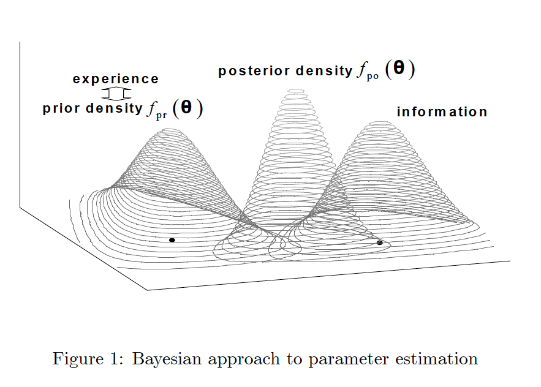
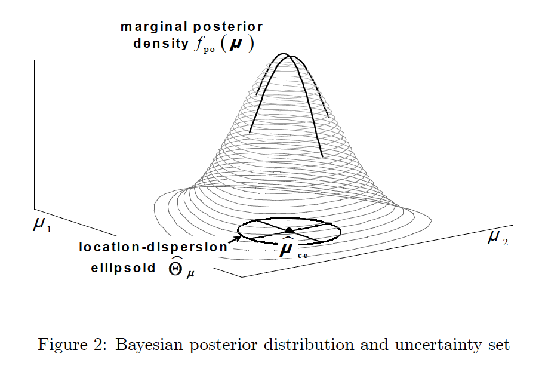
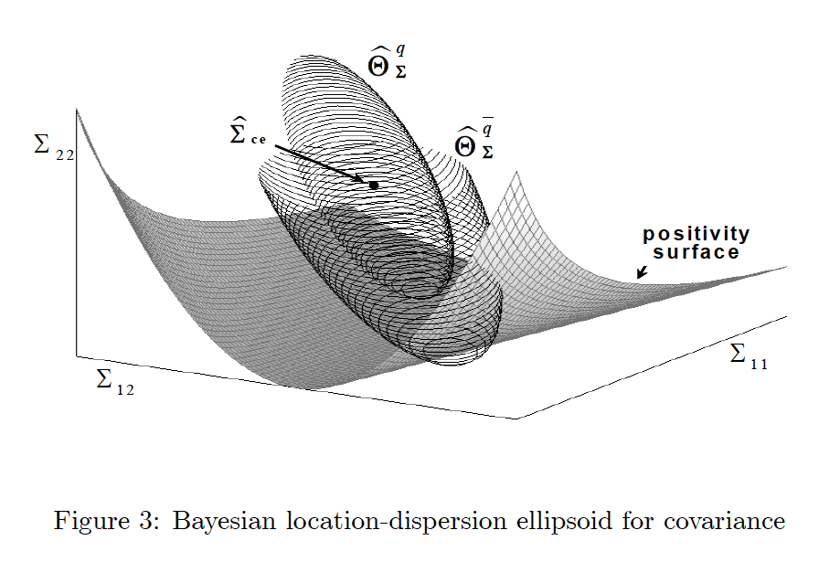

.. _portfolio_optimisation-robust_bayesian_allocation:

.. |br| raw:: html

     

.. |h3| raw:: html

    <h3>

.. |h3_| raw:: html

    </h3>

.. |h4| raw:: html

    <h4>

.. |h4_| raw:: html

    </h4>

.. note::
    The portfolio optimisation module contains different algorithms that are used for asset allocation and optimising strategies.
    Each algorithm is encapsulated in its own class and has a public method called ``allocate()`` which calculates the weight
    allocations on the specific user data. This way, each implementation can be called in the same way and this makes it simple
    for users to use them.

==========================
Robust Bayesian Allocation
==========================

The Robust Bayesian Allocation (RBA) algorithm makes assumptions about the prior market parameters, calculates the posterior market distribution and generates robust portfolios along
the Bayesian Efficient Frontier.

Overview of the Algorithm
#########################

A typical mean-variance problem reads as follows,

.. math::
    \begin{align*}
        & \underset{\mathbf{w}}{\text{maximise}} & & w^T\mu \\
        & \text{s.t.} & & w \in C \\
        &&& w^T\Sigma w \leq v
    \end{align*}

where :math:`w` is the N-dimensional vector of portfolio weights, :math:`\mu` is the set of mean returns, :math:`\Sigma` is the covariance matrix, :math:`C` is the set of investment
constraints and :math:`v` is the target volatility of the portfolio. This will generate a portfolio with the maximum return and at the same time trying to keep the portfolio volatility
at a minimum. However, most of the times, investors are concerned with finding a *robust* portfolio - one which yields the most return under the worst market condition i.e. maximum
risk/volatility.

A robust mean-variance problem can be expressed by the following equation,

.. math::
    \begin{align*}
        & \underset{\mathbf{w}}{\text{maximise}} & & \left\{\underset{\mathbf{\mu \: \in \: \theta_{\mu}}}{\text{min}} \: w^T\mu\right\} \\
        & \text{s.t.} & & w \in C \\
        &&& \underset{\mathbf{\Sigma \: \in \: \theta_{\Sigma}}}{\text{max}} \left\{w^T\Sigma w\right\} \leq v
    \end{align*}

where :math:`\theta_{\mu}` and :math:`\theta_{\Sigma}` are the uncertainty regions for :math:`\mu` and :math:`\Sigma` respectively. In a Bayesian setting, these unknown market parameters
:math:`\theta` (in our case :math:`\mu` and :math:`\Sigma`) can be modelled as random variables coming from some distributions.

In the previous image, :math:`f_{pr}(\theta)` represents the prior distribution and *information* stands for the likelihood distribution - historical observations produced by the model
given the previously mentioned prior distribution. Using the prior and likelihood, we formulate the posterior distribution :math:`f_{po}(\theta)` which describes the probability of
achieving the current set of parameters given the current data.

**The region where the posterior distribution displays a higher concentration deserves more attention than the tails of the distribution: this region is a natural choice for the uncertainty set, which in the Bayesian literature is known as credibility set.**

The credibility set for :math:`\mu` is represented by the location dispersion ellipsoid of the marginal posterior distribution of :math:`\mu`. The above image shows such a region for a 2-asset portfolio.

.. math::
    \theta_{\mu} = \left\{\mu: (\mu - \hat{\mu}_{ce})^{T}S_{\mu}^{-1}(\mu - \hat{\mu}_{ce}) \leq q_{\mu}^{2}\right\}

where, :math:`q_{\mu}` is the radius factor of the ellipsoid and the :math:`\hat{\mu}_{ce}` is a classical estimator such as the mean or mode of :math:`\mu`. :math:`S_{\mu}` is the
covariance matrix of errors in estimating the posterior distribution of :math:`\mu`.

Similarly, we have the uncertainty region for the posterior distribution of :math:`\Sigma` where there is a higher probability of containing the true covariance matrix.

.. math::
    \theta_{\Sigma} = \left\{\Sigma: vech[\Sigma - \hat{\Sigma}_{ce}]^{T}S_{\Sigma}^{-1}vech[\Sigma - \hat{\Sigma}_{ce}] \leq q_{\Sigma}^{2}\right\}

Here, :math:`vech` operator stacks the columns of a matrix skipping the redundant columns above the diagonal; :math:`q_{\Sigma}` is the radius factor for the ellipsoid;
:math:`\hat{\Sigma}_{ce}` is the classical estimator like mean or mode for the posterior distribution of :math:`\Sigma` and :math:`S_{\Sigma}` is the covariance matrix of errors in
estimation of :math:`\Sigma`.

.. tip::
    |h4| Radius Factor of the Ellipsoid |h4_|
    The radius factors :math:`q_{\mu}` and :math:`q_{\Sigma}` play an important role in the above described Bayesian setting. These are hyperparameters that can change the nature of
    robust portfolio identified by the RBA algorithm. Intuitively, a higher value of :math:`q` corresponds to a more conservative investor while a lower value represents a more risky
    investor who is not too concerned about poorly estimating :math:`\mu` and :math:`\Sigma`. This is because the radius factor dictates the size of the ellipsoid which decides the area
    of the certainty region of the posterior distribution. Hence a higher value increases the probability of finding the true parameter value within the uncertainty region while a low
    value will have less chance of finding the true parameter value and ultimately more risk.

Having understood the background of the Bayesian setting of our problem, we now focus on the steps of the RBA algorithm. On a high level, it works as follows:

Prior Market Distribution
*************************

The first step is to formulate assumptions about the market dynamics and prior knowledge of the parameters which influence these dynamics. The following assumptions are made:

1. The market consists of equity-like securities for which the returns are independently and identically distributed across time.
2. The estimation interval is the same as the investment horizon.
3. Market returns are normally distributed.

Finally, the prior distributions of :math:`\mu` and :math:`\Sigma` are assumed to be Normal-Inverse-Wishart:

.. math::
    \mu_{prior} | \Sigma_{prior} \: \sim{~} \: N\left(\mu_{o}, \frac{\Sigma_{prior}}{T_{o}}\right)

.. math::
    \Sigma_{prior}^{-1} \: \sim{~} \: W\left(v_{o}, \frac{\Sigma_{o}^{-1}}{v_{o}}\right)

where :math:`(\mu_{o}, \Sigma_{o})` represent the investor’s experience on the parameters, whereas :math:`(T_{o}, v_{o})` are the investor's confidence in the prior market parameters.

Likelihood Distribution
***********************

The likelihood distribution comes from the sample historical data of the market - the sample mean :math:`\hat{\mu}` and sample covariance :math:`\hat{\Sigma}`

.. math::
    \hat{\mu} = \frac{1}{T}\sum_{t=1}^{T}r_t

.. math::
    \hat{\Sigma} = \frac{1}{T}\sum_{t=1}^{T}(r_t - \hat{\mu})^{2}

where :math:`r` is the return series of the asset and :math:`T` is the total number of observations in the series.

Find the Posterior Market Distribution
**************************************

With our prior and likelihood distributions in place, the next step is to derive the posterior market distribution. Without going into the details of the results and derivations, it
suffices to say that the posterior distribution - :math:`\mathbf{\mu_{posterior}}` and :math:`\mathbf{\Sigma_{posterior}}` - also comes from the Normal-Inverse-Wishart distribution:

.. math::
    T_1 = T_o + T1 = T_o + T

.. math::
    v_1 = v_o + T

.. math::
    \mathbf{\mu_{posterior}} = \frac{1}{T_1}[T_o\mu_o + T\hat{\mu}]

.. math::
    \mathbf{\Sigma_{posterior}} = \frac{1}{v_1}\left[v_o\Sigma_o + T\hat{\Sigma} + \frac{(\mu_o - \hat{\mu})(\mu_o - \hat{\mu})^{T}}{\frac{1}{T} + \frac{1}{T_o}}\right]

The marginal posterior distribution - :math:`\mu_{posterior} | \Sigma_{posterior}` - is multivariate Student :math:`t`.

Calculating Uncertainty Sets
****************************

From the above derived expressions, we can now calculate the empirical estimator and uncertainty region parameters,

.. math::
    \hat{\mu}_{ce} = \mu_{posterior} \\

.. math::
    S_{\mu} = \frac{1}{T_1}\frac{v_1}{v_1 - 2}\Sigma_1 \\

.. math::
    \Sigma_{ce} = \frac{v_1}{v_1 + N + 1}\Sigma_{1} \\

.. math::
    S_{\Sigma} = \frac{2v_{1}^{2}}{(v_1 + N + 1)^{3}}(D_{N}^{T}(\Sigma_{1}^{-1} \bigotimes \Sigma_{1}^{-1})D_N)^{-1}

where :math:`D_N` is the duplication matrix that reinstates the redundant entries above the diagonal of a symmetric matrix and :math:`\bigotimes` is the Kronecker product.

Finding the Robust Bayesian Portfolio
*************************************

The robust Bayesian portfolio :math:`\mathbf{w_{RB}}` is given by the following optimisation framework:

.. math::
    \begin{align*}
        \mathbf{w_{RB}} = \underset{\: \: \: \: \mathbf{w} \in C \\ \mathbf{w^{T}}\Sigma_{1}\mathbf{w} \: \leq \: \gamma_{\Sigma}}{\text{argmax}} \left\{\mathbf{w^{T}}\mu_{posterior} - \gamma_{\mu}\sqrt{\mathbf{w^{T}}\Sigma_{posterior}\mathbf{w}} \right\}
    \end{align*}

where,

.. math::
    \begin{align*}
        \gamma_{\mu} = \sqrt{ \frac{q_{\mu}^{2}}{T_1}\frac{v_1}{v_1 - 2} } \\
        \gamma_{\Sigma} = \frac{V}{\frac{v_1}{v_1 + N + 1} + \sqrt{ \frac{2v_{1}^{2}q_{\Sigma}^{2}}{(v_1 + N + 1)^{3}} }}
    \end{align*}

Under standard regularity assumptions for the investment constraints :math:`C`, one can solve for the above solution using a standard quadratic solver.

.. tip::
    |h4| Underlying Literature |h4_|
    - The original paper by Atilio Meucci: `Robust Bayesian Allocation <https://papers.ssrn.com/sol3/papers.cfm?abstract_id=681553/>`_. All images shown above are taken from the original
    paper.

Implementation
##############

.. automodule:: mlfinlab.portfolio_optimization.bayesian.robust_bayesian_allocation

    .. autoclass:: RobustBayesianAllocation
        :members:

        .. automethod:: __init__

.. tip::
    |h4| More About the Confidence Parameters :math:`(T_o, v_o)` |h4_|
    The confidence parameters play an important part in how the final robust portfolio turns out to be. If the number of sample observations :math:`T` is significantly larger than the
    investor's prior confidence, the posterior distribution shifts in the direction of the sample mean and sample covariance and we obtain a sample-based efficient frontier. On the
    other hand, if the prior confidence is relatively larger than :math:`T`, then the posterior parameters are closer to the prior distribution and we obtain a prior-based efficient
    frontier.

Example Code
############

.. code::

    import numpy as np
    from mlfinlab.portfolio_optimization.bayesian import RobustBayesianAllocation

    num_assets = len(true_mean)
    num_observations = 1000 # Number of time series observations to use for the model.
    returns = np.random.multivariate_normal(mean=true_mean, cov=true_covariance, size=num_observations)

    # Sample estimate
    sample_mean = np.mean(returns, axis=0).reshape((num_assets, 1))
    sample_covariance = np.cov(returns, rowvar=False)

    # Bayesian prior
    prior_covariance = np.diag(np.diag(sample_covariance))
    prior_mean = 0.5 * sample_covariance.dot(np.ones((num_assets, 1))) / num_assets

    # Do robust bayesian allocation
    bayes_allocator = RobustBayesianAllocation(discretisations=10)
    bayes_allocator.allocate(
        sample_mean=sample_mean,
        sample_covariance=sample_covariance,
        prior_mean=prior_mean,
        prior_covariance=prior_covariance,
        relative_confidence_in_prior_mean=1e-5,
        relative_confidence_in_prior_covariance=1e-5,
        max_volatility=0.8 * max(sample_mean),
        sample_size=num_observations
    )

    # Get the weights
    portfolio_weights = bayes_allocator.weights
