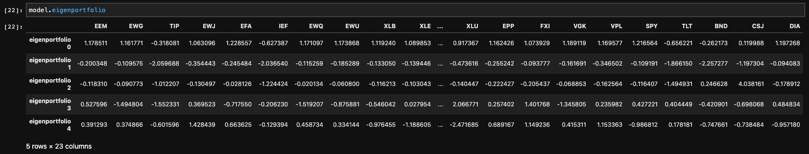
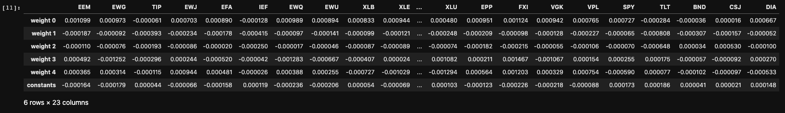
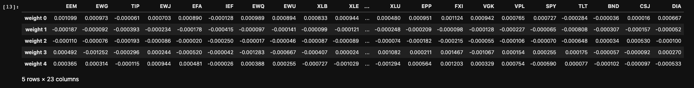
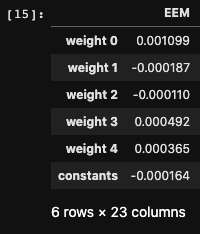
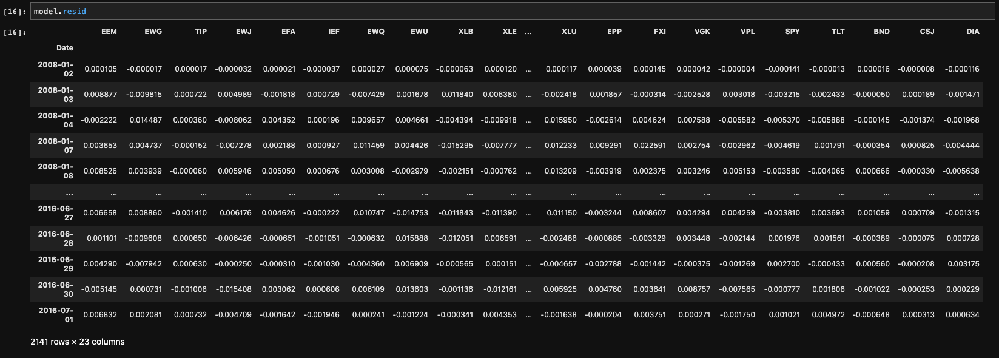
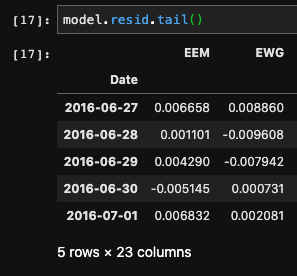
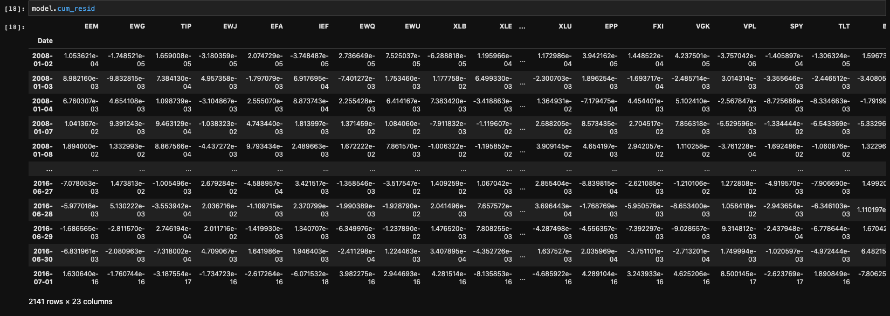
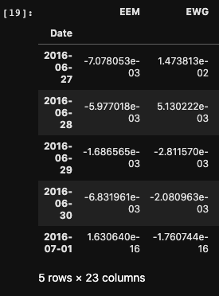
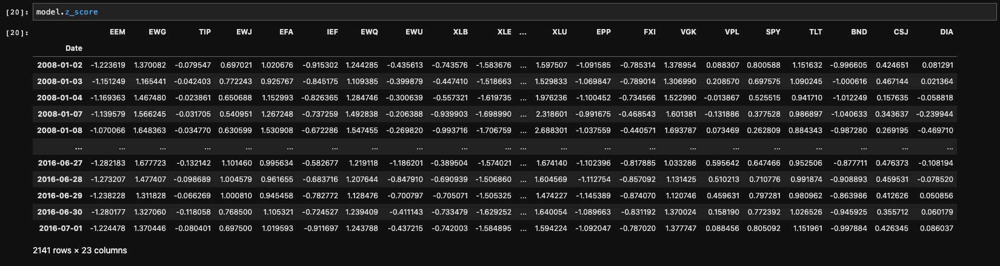

.. _statistical_arbitrage-eigenportfolio:
.. note::

    Strategies were implemented with modifications from:

    1. `Avellaneda, M. and Lee, J.H., 2010. Statistical arbitrage in the US equities market. Quantitative Finance, 10(7), pp.761-782.
    <https://www.tandfonline.com/doi/pdf/10.1080/14697680903124632>`_

==============
Eigenportfolio
==============

Principal Component Analysis (PCA) is often used as a tool for dimensional reduction. The formulation,
based on Linear Algebra, effectively identifies the directions with the largest variations with the
corresponding eigenvectors and eigenvalues.

We can calculate the principal components and the projection of the original dataset by decomposing
the covariance matrix of the original data. Because PCA is sensitive to outliers and noise, we will
normalize the data. The covariance matrix of the normalized data will then be:

.. math::
    \frac{1}{n} \cdot X^T * X

`Singular Value Decomposition`_ can also be applied to this by stating:

.. _`Singular Value Decomposition`: https://en.wikipedia.org/wiki/Singular_value_decomposition

.. math::
    \frac{1}{n} \cdot X^T \cdot X = U \cdot \Sigma \cdot V^T

:math:`U` is the left principal component, each :math:`s` in :math:`\Sigma` is the singular value, and
:math:`V^T` is the right principal componenet.

For this module, we will focus on the first method and perform an eigendecomposition to obtain the
eigenvector and eigenvalue of the data's covariance matrix. Avellaneda and Lee suggested an extremely
important concept of eigenportfolios as interpreting PCA on returns data.

They state that the eigenvectors corresponding to the larger eigenvalue of the covariance matrix
are the general market direction. The subsequent eigenvectors with smaller eigenvalues can be
interpreted as idiosyncratic returns. Because each eigenvector is orthogonal, and therefore
uncorrelated, we can safely assume that systematic returns can be distinguished from the
idiosyncratic returns.

The eigenportfolios are calculated by:

1. Calculate the correlation matrix.
2. Perform eigendecomposition on the correlation matrix.
3. Sort the eigenvectors by its corresponding eigenvectors in descending order.
4. Choose the top-n principal components.
5. Divide the eigenvector by the standard deviation.
6. Each new eigenvector is now the eigenportfolio, and the projected returns are calculated by the
   dot product of the original data and the new eigenportfolio.

Implementations
###############

We created a general class called ``Eigenportfolio`` to implement Avallaneda and Lee's work.
This class will allow us to quickly implement and modularize the various ways of identifying
the trading assets and seeking different hedge ratios to capture the idiosyncratic risk.

.. automodule:: mlfinlab.statistical_arbitrage.eigenportfolio

    .. autoclass:: Eigenportfolio
        :members:
        :inherited-members:

Results
#######

Price
*****

``model.price`` is used to call the originally given price data.

Log Returns
***********

``model.log_returns`` is used to call the log-returns of the given data.

Eigenportfolio
**************

``model.eigenportfolio`` is used to call the eigenportfolio of the given data.

Each portfolio contains ``x`` amount of allocation on each asset.

Beta
****

``model.beta`` is used to call beta, the hedge ratio, of the given data.

There are two different beta values possible for any given combination of a portfolio. The user
has the choice of choosing ``intercept=True`` or ``intercept=False``. If ``True``, the model will
fit the regression parameters without an intercept and will not see a constant value. If ``False``
, the model will not fit the regression parameters to an intercept. This intercept value corresponds
to the :math:`\alpha` value of the Ornstein-Uhlenbeck process. This term is the drift term which
indicates if there is a trend within the residual process. Often times, this value is closer to 0
and therefore can be easily discarded, but for a more robust and statistical analysis of pairs
trading, it is important to understand how this drift term affects your results.

   intercept=True

   intercept=False

For an example run of the ``Eigenportfolio`` class, we see that the beta did not change, but in the
long run, this might greatly affect the returns based on the system.

This ``beta`` also indicates the hedge ratio, which means that for 1 unit of x, there will be
a ``beta`` change of y in returns. Specifically for the eigenportfolio, we will zoom into the first
column of the given model with constants.

   EEM

This represents the formulation that a given unit change in returns for EEM can be regressed as a
function of:

.. math::

    \Delta EEM = 0.001099 \cdot \Delta EP_0 - 0.000187 \cdot \Delta EP_1 - 0.000110 \cdot \Delta EP_2

    + 0.000492 \cdot \Delta EP_3 + 0.000365 \cdot \Delta EP_4 - 0.000164

- :math:`\Delta EEM`: Change in returns for EEM
- :math:`\Delta EP_n`: Change in returns for Eigenportfolio n

Residuals
*********

``model.resid`` is used to call the residuals of the regression model.

    Residuals

We can easily see the log-returns residuals for each asset regressed on the different combinations of
the calculated eigenportfolios.

    First two columns

We can interpret the results in the following way:

- 2016-06-27: EEM's returns were 0.006658 higher than the returns from corresponding equation above.
- 2016-06-28: EEM's returns were 0.001101 higher than the returns from corresponding equation above.

Cumulative Residuals
********************

``model.cum_resid`` is used to call the cumulative residuals of the regression model.

    Cumulative Residuals

The cumulative residuals are used to calculate the signals for long/short for the statistical
arbitrage strategy.

    First two columns

We can interpret the results in the following way:

- 2016-06-27: EEM's cumulative returns were 7.078e-3 lower than the cumulative returns from corresponding equation above.
- 2016-06-28: EEM's cumulative returns were 5.977e-3 lower than the cumulative returns from corresponding equation above.
- 2016-07-01: EEM's umulative returns are identical to the cumulative returns from corresponding equation above.

The last phenomena happens as we are using regression as a tool for analysis. OLS causes our regression
to converge to 0 for the last data point.

Z-Score
*******

``model.z_score`` is used to call the z_score of the cumulative residuals of the regression model.

Traditional methods for z-score signals from the example that we used can be:

1. At z-score of 2, long 1 of EEM and short :math:`\beta` of the combination of Eigenportfolios.

2. At z-score of 1, close out your trades.

3. At z-score of -2, short 1 of EEM and long :math:`\beta` of the combination of Eigenportfolios.

4. At z-score of -1, close out your trades.

Example Code
############

.. code-block::

    import pandas as pd
    from mlfinlab.statistical_arbitrage import *

    # Read in data.
    stock_prices = pd.read_csv('FILE_PATH', parse_dates=True, index_col='Date')

    # Create StatArb model.
    model = Eigenportfolio()

    # Allocate with no window, default intercept of True, and 5 principal components.
    model.allocate(stock_prices, pc_num=5)

    # Allocate with no window, no intercept, and 3 principal components.
    model.allocate(stock_prices, pc_num=3, intercept=False)

    # Allocate with window of 60, no intercept, and 4 principal components.
    model.allocate(stock_prices, pc_num=4, window=60, intercept=False)

    # Allocate with window of 90, default intercept of True, and 5 principal components.
    model.allocate(stock_prices, pc_num=5, window=90)

    # Get log returns.
    model.log_returns

    # Get eigenportfolio.
    model.eigenportfolio

    # Get beta, the hedge ratio.
    model.beta

    # Get residuals.
    mode.resid

    # Get cumulative residuals.
    model.cum_resid

    # Get z_score.
    model.z_score
