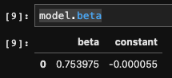
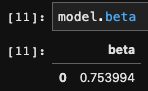
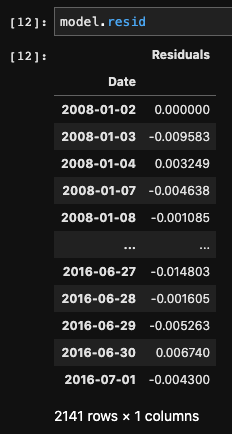
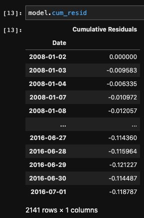
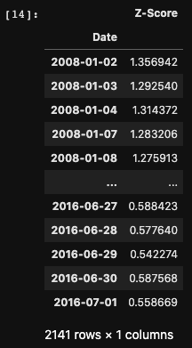

.. _statistical_arbitrage-pairs_trading:
.. note::

    References

    1. `Gatev, E., Goetzmann, W.N. and Rouwenhorst, K.G., 2006. Pairs trading: Performance of a
    relative-value arbitrage rule. The Review of Financial Studies, 19(3), pp.797-827.
    <https://academic.oup.com/rfs/article/19/3/797/1646694>`_

=============
Pairs Trading
=============

Pairs trading strategy is a specific statistical arbitrage strategy that focuses on two assets.
Pairs trading harnesses the pricing inefficiency caused by the widening spread of two assets.
Generally, pairs trading strategies can be implemented in three parts.

1. Filter the universe to select a number of pairs. These pairs are two related securities,
which are oftentimes in the same sector/industry and have similar fundamental values.

2. Calculate the spread between the two pairs and test for stationarity and cointegration.

3. If all the tests are satisfied, generate trading signals to long the asset that is underpriced
and short the other.

Implementations
###############

We created a general class called ``StatArb`` to create a general pairs trading strategy framework.
This parent class will allow us to quickly implement and modularize the various ways of identifying
the trading assets and seeking different hedge ratios to capture the idiosyncratic risk.

.. automodule:: mlfinlab.statistical_arbitrage.base

    .. autoclass:: StatArb
        :members:
        :inherited-members:

Results
#######

Rolling Window
**************

All results can be used with a rolling window function with a given ``window=number``.

Price
*****

``model.price`` is used to call the originally given price data with the first column as x
and the second column as y.

Log Returns
***********

``model.log_returns`` is used to call the log-returns of the original data.

Beta
****

``model.beta`` is used to call beta, the hedge ratio, of the given data.

There are two different beta values possible for any given combination of a portfolio. The user
has the choice of choosing ``intercept=True`` or ``intercept=False``. If ``True``, the model will
fit the regression parameters without an intercept and will not see a constant value. If ``False``
, the model will not fit the regression parameters to an intercept. This intercept value corresponds
to the :math:`\alpha` value of the Ornstein-Uhlenbeck process. This term is the drift term which
indicates if there is a trend within the residual process. Often times, this value is closer to 0
and therefore can be easily discarded, but for a more robust and statistical analysis of pairs
trading, it is important to understand how this drift term affects your results.

For an example run of the ``StatArb`` class, we see that the beta value barely changed, but in the
long run, this might greatly affect the returns based on the system.

This ``beta`` also indicates the hedge ratio, which means that for 1 unit of x, there will be
a ``beta`` change of y in returns.

Residuals
*********

``model.resid`` is used to call the residuals of the regression model.

We can easily see the log_returns residuals by ``price_x``’s regression on ``price_y`` with
the :math:`\beta` of ``model.beta``.

Cumulative Residuals
********************

``model.cum_resid`` is used to call the cumulative residuals of the regression model.

The cumulative residuals are used to calculate the signals for long/short for the statistical
arbitrage strategy.

Z-Score
*******

``model.z_score`` is used to call the z_score of the cumulative residuals of the regression model.

Traditional methods for z-score signals include:

1. At z-score of 2, long 1 of ``price_x`` and short :math:`\beta` of ``price_y``

2. At z-score of 1, close out your trades.

3. At z-score of -2, short 1 of ``price_x`` and long :math:`\beta` of ``price_y``

4. At z-score of -1, close out your trades.

Example Code
############

.. code-block::

    import pandas as pd
    from mlfinlab.statistical_arbitrage import *

    # Read in data.
    stock_prices = pd.read_csv('FILE_PATH', parse_dates=True, index_col='Date')

    # Set price_x and price_y.
    price_x = stock_prices.iloc[:, 0]
    price_y = stock_prices.iloc[:, 1]

    # Create StatArb model.
    model = StatArb()

    # Allocate with no window and default intercept of True.
    model.allocate(price_x, price_y)

    # Allocate with no window and intercept of False.
    model.allocate(price_x, price_y, intercept=False)

    # Allocate with window of 60 and default intercept of True.
    model.allocate(price_x, price_y, window=60)

    # Allocate with window of 60 and intercept of False.
    model.allocate(price_x, price_y, window=90, intercept=False)

    # Get log returns.
    model.log_returns

    # Get beta, the hedge ratio.
    model.beta

    # Get residuals.
    mode.resid

    # Get cumulative residuals.
    model.cum_resid

    # Get z_score.
    model.z_score
