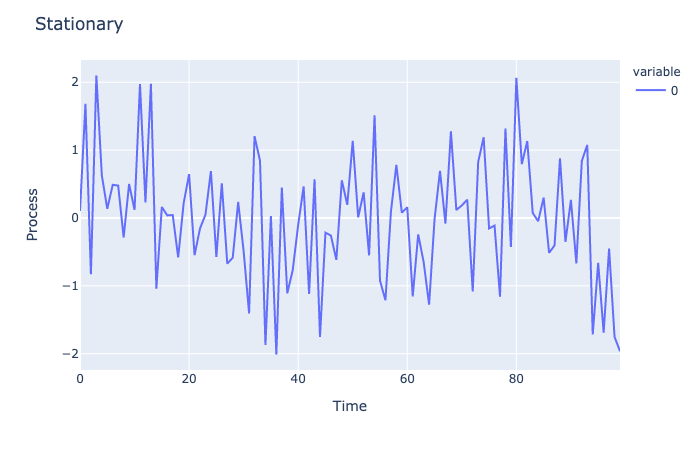

.. _statistical_arbitrage-stationarity:
.. note::

    References

    1. `Gatev, E., Goetzmann, W.N. and Rouwenhorst, K.G., 2006. Pairs trading: Performance of a
    relative-value arbitrage rule. The Review of Financial Studies, 19(3), pp.797-827.
    <https://academic.oup.com/rfs/article/19/3/797/1646694>`_

============
Stationarity
============

A time series is defined to be stationary if its joint probability distribution is invariant
under translations in time or space. In other words, the mean and variance of the time series
do not change.

It is important to test for the spread for stationarity as statistical arbitrage typically
shows the strongest and most robust results that follow stationarity and cointegration for
the tested pairs.

Augmented Dickey-Fuller Test
****************************

Augmented Dickey-Fuller or the ADF tests the null hypothesis that a unit root is present
in a time series sample. If the time series does have a mean-reverting trend, then the next
price will be proportional to the current. The original Dickey-Fuller test only tested for
lag 1, whereas the augmented version can test for lag up to :math:`p`.

.. math::
	\Delta y_t = \alpha + \beta t + \gamma y_{t-1} + \delta_1 \Delta y_{t-1} + \cdots + \delta_{p-1} \Delta y_{t-p+1} + \epsilon_t

- :math:`\alpha`: constant variable
- :math:`\beta`: coefficient of temporal trend
- :math:`\delta`: change of :math:`y`

For the purpose of this module, we will empirically set :math:`p` to be :math:`1`.

Another important variable to consider is the presence of a trend within the spread. The most
ideal scenario for a statistical arbitrage strategy is one that does not have a trend within
the process. This, however, does not always hold true. An example of a trend stationary is shown
below:

.. image:: statarb_images/trend_stationary.png
   :width: 49 %

It is possible to detrend the trend_stationarity and the user can easily do so by setting the regression to
be ``ct`` instead of just ``c``, which is a constant residual.

.. py:currentmodule:: mlfinlab.statistical_arbitrage.stationarity

.. autofunction:: calc_adfuller

Kwiatkowski-Phillips-Schmidt-Shin
*********************************

.. py:currentmodule:: mlfinlab.statistical_arbitrage.stationarity

.. autofunction:: calc_kpss

Phillips-Perron Test
********************

To Be Implemented.

Phillips-Ouliaris Test
**********************

To Be Implemented.

Example Code
************

.. code-block::

    import pandas as pd
    import numpy as np
    from mlfinlab.statistical_arbitrage import calc_engle_granger, calc_johansen

    # Read in data.
    stock_prices = pd.read_csv('FILE_PATH', parse_dates=True, index_col='Date')

    # Change to log prices data.
    stock_prices = np.log(stock_prices)

    # Calculate ADF test on the first column with maxlag of 1.
    adf = calc_adfuller(stock_prices.iloc[:,0], maxlag=1)

    # Calculate KPSS test on the first column with nlags of 1.
    kpss = calc_kpss(stock_prices.iloc[:,0], nlags=1)
